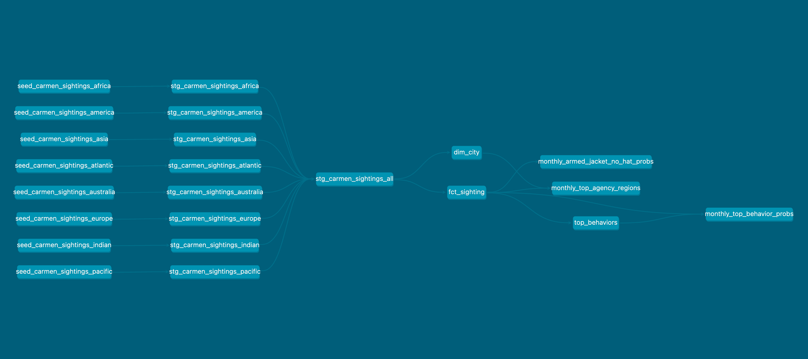
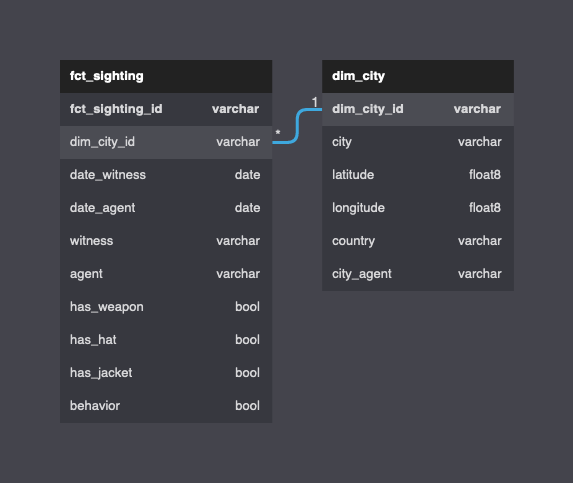
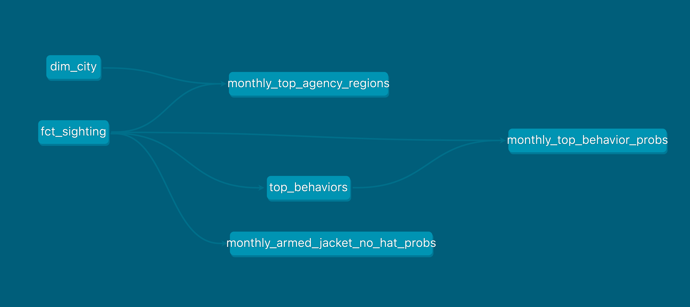

# Cascade Skills Assessment: *dbt* Data Engineer

This repository contains my submission for the Cascade Data Engineer skills assessment. The original assessment instructions can be found [here](https://github.com/cascadedebt/skills-assessment-data-engineer). My dbt project is contained in the `dbt/` directory. Instructions for running the dbt project can be found in `dbt/README.md`.

## Model Lineage and Data Modeling

The image above displays the complete dag for the data models in this project. The dag is composed of several sequential segments:

1. The raw source data, consisting dbt *seeds*.
2. Staging models, materialized as *views*. These models either rename or concatenate source data.
3. Fact and dimension models, materialized as *tables*. These models form the core basis for downstream analytics.
4. Analytics models, materialized as *views*.

### 1. Source data

The source data is broken out into 8 seeds, each containing sightings for a different region. Different seeds may use different column names, but they all record data using the same format.

### 2. Staging

The staging models add uniformity to the seed models. Each seed has a corresponding staging view that applies a consistent column name mapping. In addition, the **stg_carmen_sightings_all** model concatenates all the upstream staging models so that all source sighting data can be easily queried at once.

### 3. Dimensional Models

The "core" data models of this project consist of a *fact* and *dimension* table. They are both built off of the **stg_carmen_sightings_all** view.

- **fct_sighting** contains one record for each sighting.
- **dim_city** contains one record for each city where a sighting occurred.

When designing this schema, I assumed all the columns in **dim_city** remain constant per city (including *city_agent*). This assumption is valid for all the data used in this project, and can be verified via the uniqueness constraints placed on the *dim_city_id* column. However, if this assumption were not to hold for future data, then the current schema would need to be adjusted (e.g. **dim_city** could be modeled as a *slowly changing dimension*, or additional data models could be introduced)

#### 4. Relationship Diagram

The image below depict the relationship between **fct_sighting** and **dim_city**. Note that there is a many-to-one relationship between **fct_sighting** and **dim_city**. When writing queries, city data can be added to sighting records by joining **fct_sighting** and **dim_city** on the *dim_city_id* column. This column has been indexed to facilitate fast joins using the **indexes** model config key, although this index would be much more useful if the the tables contained more rows.

### Analytical Views

Analytical views exist downstream of the dimensional models. The dag below depicts the data lineage, starting from the dimensional models. Each analytical view contains at most two upstream dependencies, which are typically *fct_sighting* or *dim_city*. The **monthly_top_behavior** view references references **top_behavior** view because it makes use of its findings.

Analytical views that depict quantities by month use a custom month format defined in the `format_date_to_month` macro. This combines the month number (for sortability) with the month name (for readability). 

The analytical view functions often use a similar approach of grouping sightings by month and use staple SQL functions by applying `row_number` over a window for ranking and using `sum` and `count` to compute proportions.

## Analytics Questions

The analytical questions are answered below. Each answer makes use of one of the analytical view models depicted above.

### a. For each month, which agency region is Carmen Sandiego most likely to be found?

The data table from *monthly_top_agency_regions* shows that Carmen Sandiego is most likely to be found in Kolkata or New York, depending on the month:

|month_sighted|city_agent|times_observed|round|
|-------------|----------|--------------|-----|
|january  |Kolkata|98|0.085|
|february |New York|86|0.082|
|march    |New York|89|0.078|
|april    |New York|91|0.081|
|may      |Kolkata|94|0.080|
|june     |Kolkata|83|0.073|
|july     |New York|94|0.082|
|august   |Kolkata|88|0.077|
|september|New York|71|0.064|
|october  |New York|69|0.060|
|november |New York|93|0.084|
|december |Kolkata|94|0.082|

### b. Also for each month, what is the probability that Ms. Sandiego is armed AND wearing a jacket, but NOT a hat? What general observations about Ms. Sandiego can you make from this?

The data table, created from the **dbo_ana.monthly_armed_jacket_no_hat_probs**, is displayed below. The probabilities of this combination of behaviors happening during a sighting is very low for each month, hovering roughly between 3% and 5%. The month with the lowest probability for this is November, which has 2.4%. The month with the highest probability of this happening is June, with 4.7%.

|month_sighted|round|
|-------------|-----|
|january  |0.038|
|february |0.033|
|march    |0.046|
|april    |0.032|
|may      |0.035|
|june     |0.047|
|july     |0.038|
|august   |0.044|
|september|0.043|
|october  |0.043|
|november |0.024|
|december |0.045|

### c. What are the three most occurring behaviors of Ms. Sandiego?

Carmen Sandiego's most occurring behaviors are **happy**, **complaining**, and **out-of-control**. The **top_behaviors** view was used to generate the table below. 

|behavior|times_observed|
|--------|--------------|
|happy|635|
|complaining|636|
|out-of-control|637|

### d. For each month, what is the probability Ms. Sandiego exhibits one of her three most occurring behaviors?

The probability of a sighting containing the behavior **happy**, **complaining**, or **out-of-control** hovers between 12% and 15% each month. This is lowest in October, at 12.1%, and highest in May, at 15.3%.

|month_sighted|round|
|-------------|-----|
|january  |0.139|
|february |0.138|
|march    |0.149|
|april    |0.138|
|may      |0.153|
|june     |0.138|
|july     |0.139|
|august   |0.138|
|september|0.150|
|october  |0.121|
|november |0.144|
|december |0.138|

